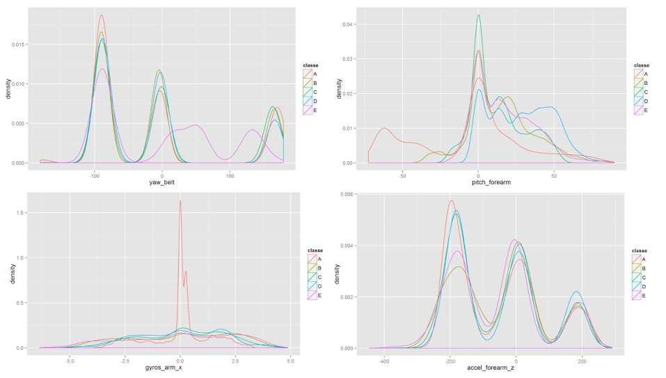

Project Practical Machine Learning
---

Author: Ana Music


Data 
---

We took our data from the links below. Training and test data for the project are available here: 

- https://d396qusza40orc.cloudfront.net/predmachlearn/pml-training.csv 

- https://d396qusza40orc.cloudfront.net/predmachlearn/pml-testing.csv

The data for the project come from the source: http://groupware.les.inf.puc-rio.br/har. The data are quantifying exercises movement measured of six participants.


The goal of the project
---

The goal of this project is to predict variable *classe*, where we measure how well did they do the exercises, and not only how much of a particular activity they did.

We used the training data to build and train the model, with which we predict variable *classe* in the test data. 

Modelling
---

In code we used some packages:
```
library(caret);
library(gbm);
library(survival);
library(splines);
library(plyr)
```
We set seed to 1 to always get the same result. We also set working directory to a directory where we saved all files.

From **pml-training.csv** file we loaded the data and saved them to a varible *training*.
```
set.seed(1)

dir = "local_directory"
setwd(dir)
training = read.csv("pml-training.csv")
```

To get some information of the *training* variable we have built a density function for each of the columns. We also wanted to build a *featurePlot*, but there are 160 columns in the *training* variable, what is too much to show on a chart. In our case (*classe* is a class type variable) we get a similar information from density function plot then from *featurePlot* (qq plots of each variable to the *classe* variable). 

Below are few examples of density functions:



In the data there are some columns with *NA* varibles. We decided not to use them, because values in those columns do not cover the whole space. They only cover aproximately 2% of it, therefore we deleted them from the *training* variable.

```
training <- training[,colSums(is.na(training)) == 0] 
```

We divide the training variable into two parts, the train set and the test set. We chose ratio p=0.75.

```
inTrain = createDataPartition(y=training$classe,p=0.75,list=FALSE)
train = training[inTrain,]
test = training[-inTrain,]
```

To set parameters for a model we use *trainControl* function. We will show later how different parameters (*number* and *repeats*) affect the quality of predicted results. 

```
fitControl <- trainControl(method  = "repeatedcv",
                           number  = N,
                           repeats = M)
```

We use *train* function to build the model. We have decided to use **gbm** method, because it is appropriate for classification problems. We will also show how preprocessing (*pca*) affect the quality of predicted results.

```
modFit <- train(classe ~ variables,
                method     = "gbm",
                data       = train,
                trControl  = fitControl,
                preProcess = "pca",
                verbose    = FALSE)
```

Based on dansity functions we have decided for some input variables for the model. We have chosen the following (but will add/remove some of them and present the results later):

```
variables = yaw_belt + total_accel_belt + accel_belt_z + roll_arm + yaw_arm + total_accel_arm + gyros_arm_x + gyros_arm_y + gyros_arm_z + accel_arm_z + pitch_forearm + roll_dumbbell
```

We check importance of model variables with the following command:

```
varImp(modFit, scale = FALSE)
```

and we predict outturns with:
```
outturn = predict(modFit,test)
```

To check quality of the model we calculate the ratio of correctly predicted values of the *classe* variable to the number of all with command:

```
length(which(outturn == test$classe))/nrow(test)
```

Results
---

**Model 1**

Parameters:

- number = 5

- repeats = 2

- no preprocessing

Running time: 5.20 mins. 

Ratio of correctly predicted: 87.79%.

```
gbm variable importance

                  Overall
yaw_belt         2965.602
accel_belt_z     2323.005
pitch_forearm    2232.246
roll_dumbbell    1089.071
roll_arm          687.420
yaw_arm           317.781
gyros_arm_y       252.914
accel_arm_z       203.116
total_accel_belt  157.730
gyros_arm_x       129.432
total_accel_arm   105.045
gyros_arm_z         4.431
```

**Model 2**

Parameters:

- number = 5

- repeats = 2

- preprocessing = pca

Running time: 4.85 mins.

Ratio of correctly predicted: 65.21%.

```
gbm variable importance

    Overall
PC5  2047.5
PC2   722.7
PC4   700.9
PC1   636.8
PC3   624.2
PC6   530.2
PC7   396.2
PC8   237.1
```

**Model 3**

Parameters:

- number = 5

- repeats = 2

- no preprocessing

- we exclude *gyros_arm_z* variable. If we run ```varImp``` command in model 1, we see that it is the least important.

Running time: 4.30 mins.

Ratio of correctly predicted: 87.81%.

```
gbm variable importance

                 Overall
yaw_belt          2965.6
accel_belt_z      2323.0
pitch_forearm     2232.2
roll_dumbbell     1089.1
roll_arm           687.4
yaw_arm            317.8
gyros_arm_y        252.9
accel_arm_z        203.1
total_accel_belt   157.7
gyros_arm_x        132.8
total_accel_arm    105.0
```

**Model 4**

Parameters:

- number = 7

- repeats = 2

- no preprocessing

- *gyros_arm_z* variable excluded

Running time:  6.58 mins.

Ratio of correctly predicted: 88.01%.

```
gbm variable importance

                 Overall
yaw_belt         3016.46
pitch_forearm    2302.01
accel_belt_z     2281.33
roll_dumbbell    1140.94
roll_arm          664.81
yaw_arm           317.33
gyros_arm_y       282.99
accel_arm_z       234.00
gyros_arm_x       147.78
total_accel_belt  134.33
total_accel_arm    82.55
```

Summary
---

We choose model 4, because we get the best results. We made our decision based on a ratio of correctly predicted values of the *classe* variable. The ratio of model 4 is 88.01%.

Remark: We did not decide for the default model settings, because of very long run time.


**Hardware specification**:

CPU: Intel(R) Core(TM) i5-4200U CPU @ 1.60GHz

RAM: 8 GB

OS: Windows 7 Professional 64bit

R version: 3.1.1, 32 bit


